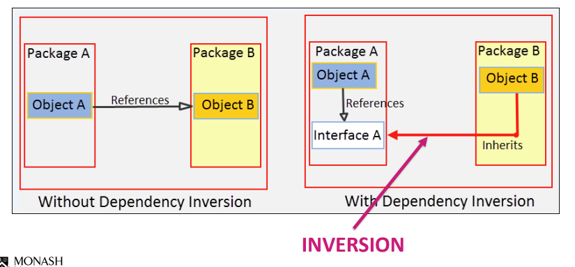

# SOLID Principles

A set of 5 design principles created by Robert C. Martin in 2000.

S -> Single Responsibility Principle
O -> Open - Closed Principle
L -> Liskov Substitution Principle
I -> Interface Segregation Principle
D -> Dependency Inversion Principle

## Single Responsibility Principle

> A class should have one and only one responsibility.  
> Gather together the things that change for the same reasons.  
> Seperate those things that change for different reasons.

- A class should not have more than one responsibility, i.e. doing more than one thing.
- Makes classes cohesive
- Maintainability and extensibility

### Breaching SRP

a) God Classes

- A class that handles everything - too many responsibilities

b) Classes that are too small

- takes SRP too far
- overcomplicates the design

### Applying SRP

This class:

```java
public class Employee {
    public String name;
    private double pay;
    private double hours;

    public void computePay();
    public void reportHours();
}
```

Can be refactored into:

```java
public class Employee {
    public String name;
    private PayCalculator pay_calculator;
    private HourReporter hour_reporter;
}

public class PayCalculator {
 ...
    public void computePay();
}

public class HourReporter {
 ...
    public void reportHours();
}
```

### Lack of Cohesion in Methods (LCOM) metric

$$LCOM = 1 - \frac{\sum{|M_f|}}{|M||F|}$$

Where:

M = set of static and instance methods in the class
F = set of instance fields in the class
|M_f| = methods accessing field f


A metric that describes the cohesion of methods in a class.

A low LCOM means that the class has low cohesion, which might mean that the design of the class is good.

A high LCOM means that the class has high cohesion, i.e. that the design of the class might be poor.

However, this is not applicable to every case, and should only be considered with a grain of salt.

## Open - Closed Principle

> Software entities should be open for extension, but closed for modification.

A class should be open to adding new features without modifying old code that might affect how old features functions.

- Maintainability and extensibility

### OCP Practices

Use interfaces

## Liskov Substitution Principle

> Let $\phi(x)$ be a property provable about objects $x$ of type $T$. Then $\phi(y)$ should be true for objects $y$ of type $S$ where $S$ is a subtype of $T$.

> An instance of subclass should be able to replace its superclass in any part of the code without breaking the software.

For example define two classes:

```java

class A {}

class B extends A {}
```

In any part of the code,

Since all methods in A exist in B, the following code should work:

```java
A a = new B(); // should work
```

### Breaching LSP

LSP is broken if a subclass cannot do everything its base class can.

in C++, LSP can easily be broken:

```cpp
class A {}

class B : private A {} // methods in B are private, breaks LSP
```

#### Example: Circle - Elipse problem

Define two problematic classes:

```java
public class Elipse {
    ...
    public void strech();
}

public class Circle extends Elipse {}

```

A circle is an elipse.

If you strech an elipse, it is still an elipse.

However, if you strech a circle, it is no longer a circle.

```java
Circle.strech(); // not reasonable
```

Therefore, circle cannot inherit elipse without breaking LSP.

We can solve this by creating a shared superclass (polymorphism):

```java

class Shape {}

class Elipse extends Shape {
    ...
    public void strech();
}

class Circle extends Shape {}
```

## Interface Segregation Principle

> Clients should not be forced to depend upon interfaces that they do not use.

Intefaces should be small and only contain the necessary methods / fields that are required to be implemented, no more and no less.

- Easier to add new features without needing to refactor

### Breaking ISP: Interface pollution

Interfaces should not be "polluted" with uneccessary functions.

For example, define the following problematic code:

```java
public interface Calculator {
    public double add();
    public double sub();
    public double mul();
    public double div();
    public double sin();
    public double cos();
    public double tan();
    public double log();
    public double sqrt();
}
```

What if the client only needed a basic calculator? We would have extra functions to implement but will be unused.

We can solve this by breaking up the interaces:

```java
public interface BasicCalculator {
    public double add();
    public double sub();
    public double mul();
    public double div();
}

public interface AdvCalculator {
    public double sin();
    public double cos();
    public double tan();
    public double log();
    public double sqrt();    
}
```

## Dependency Inversion Principle

> High-level modules should not depend on low-level modules. Both should depend on abstractions.

> Abstractions should not depend on details. Details should depend on abstractions.

- High-level modules should depend on interfaces rather than low-level code, i.e. insert an abstraction layer between dependent classes

- Both parts insulated from change



### Applying DIP

Define the following problematic classes:

```java
public class Manager {
    private Developer[] developers;
    private Designer[] designers;
    private Tester[] testers;
}

public class Developer {}
public class Designer {}
public class Tester {}
```

The current code is too tightly coupled as Manager directly depends on Developer, Designer and Tester, which breaks the DIP.

We can refactor it as such by introducing an abstraction in between them:

```java
public class Manager {
    private ArrayList<Employee> employees;
}

public interface Employee {}

public class Developer implements Employee {}
public class Designer implements Employee {}
public class Tester implements Employee {}
```

This code is better because there is a layer of abstraction between Manager and Developer, Designer and Tester.